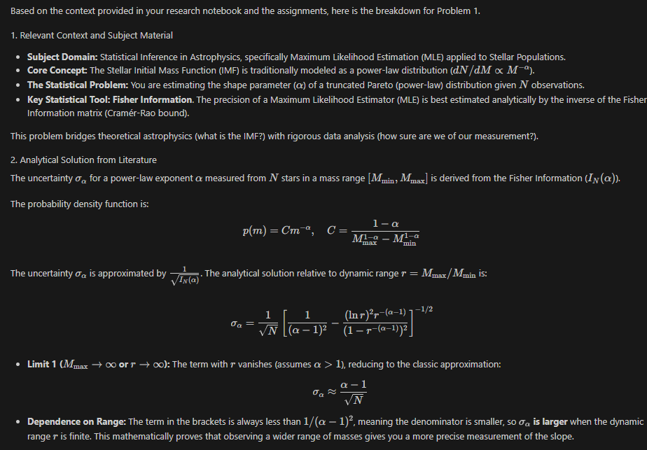
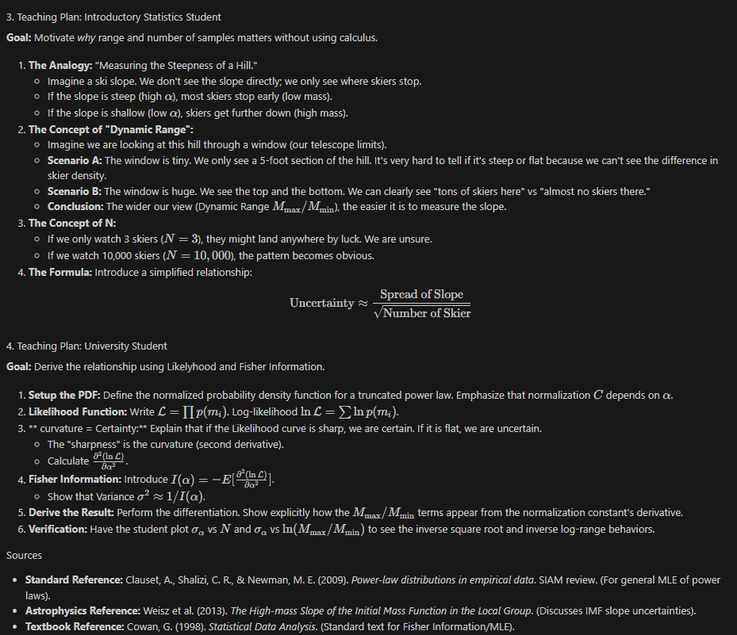
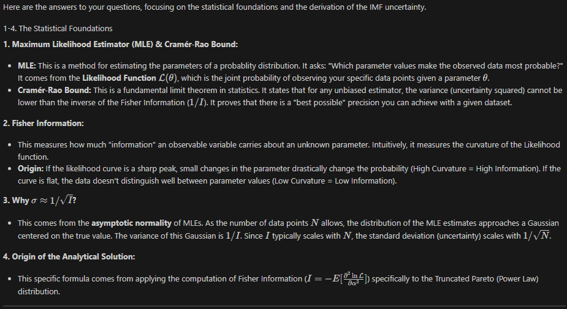
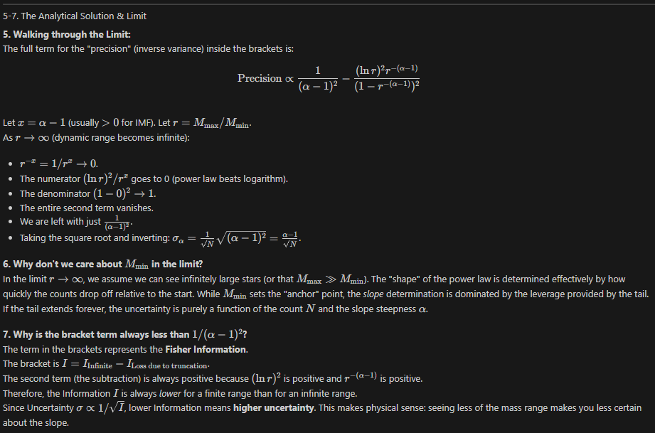
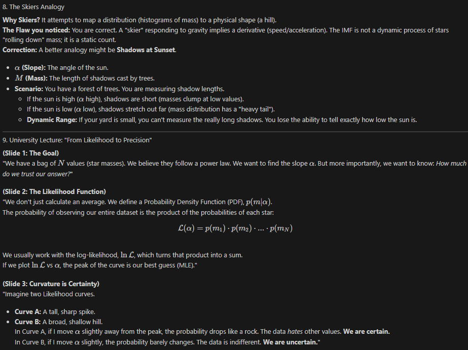
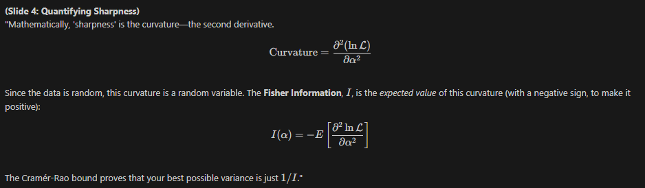
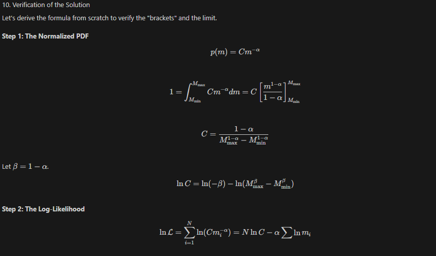
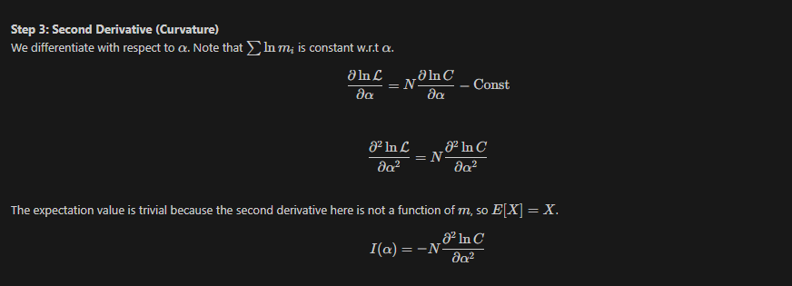
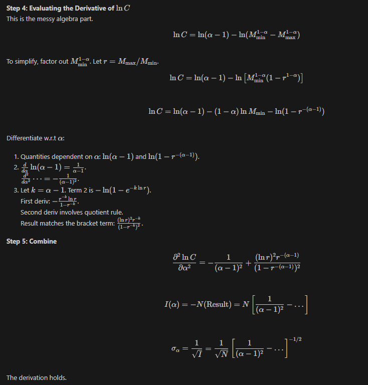

# Research Notebook for AST250 Stellar Populations with Dan Weisz
A large element of the class is exploring how generative AI can be used in a scientific workflow. I’ll be recording the results of my experiments here.

**Jan 22nd 2026**
- Decided to take a slightly different approach today than just jumping into the research problem. I wanted to make sure that my environment was set up to work well and successfully. I tried to get GitHub Copilot or to figure out another way to link AI Coding into my VSCode environment. 
- GitHub Copilot takes an @astro.berkeley.edu email address. I'm not sure I have one (tried noah.stiegler@astro.berkeley.edu). Emailed Bill Boyd to try to set one up
- In the meantime, I wanted to setup a research notebook which works in VSCode. I downloaded the [MDOffice](https://marketplace.visualstudio.com/items?itemName=06401f15-a30d-6a97-82a3-8ca0e379c4eb.md-office-editor) and [Image Paste](https://marketplace.visualstudio.com/items?itemName=mushan.vscode-paste-image) extensions in VSCode which turns markdown files into slightly more accessible MS office style documents which I can edit directly in VSCode as well as letting me paste screenshots in (puts the screenshots in a folder and links them to the markdown file)
- To find these extensions, I used Gemini, and prompted it with "Is there an equivalent to a microsoft word file which I can edit through VSCode easily? I want text editing, formatting, and the ability to copy/paste screenshots"
- MDoffice extension doesn't work super well. Sometimes it loses words that I type. The "link to external page" button doesn't work. I uninstalled
- I got frustrated and searched the extension store on my own. I found [Markdown All in One](https://marketplace.visualstudio.com/items?itemName=yzhang.markdown-all-in-one) and [Markdown Preview](https://marketplace.visualstudio.com/items?itemName=shd101wyy.markdown-preview-enhanced) extensions. Downloading them worked well. I wanted to have the renderd markdown file automatically open and track alongside me as I typed. I asked "What extension has the markdown text and the rendered file side-by-side automatically?" to see if it would recommend one to me, but it told me that I could just enable a setting in Markdown All in One if I had it installed, which was helpful (as it had recommended this one earlier too)
- I had prompted all of these questions in the same instance of Gemini so it knew I was on the same thread. Responding as I would to a new google prompt (as opposed to feigning conversation which may be more similar to the works it was trained on) worked well enough

**January 27th, 2026**
- Starting on problem 1
- I'm using the Gemini 3 pro model in VSCode's GitHub Copilot chat window in "ask" mode
- I prompted it with: 
> I'm studying the stellar initial mass function (IMF). You are a research assistant and teacher intent on guiding me to discovering and understanding the solution. 
>
> We're going to start with Problem 1 from the .pdf assignment. We're measuring the stellar IMF from a population of N stars where each star has a mass M. Here, there is a maximum and minimum mass that we have in our sample, M_Max and M_Min. There is an analytical approximation for the precision with which a single power law slope alpha can be measured in this case. We'll describe this uncertainty as sigma_alpha and it should be a function of the total number of stars measured and the dynamic range (M_Max / M_min) in the sample. 
> 
> First, determine the relevant context and subject material for the problem. Second, find what the analytical solution to this scenario should be from the literature. Third, come up with a plan to motivate and then teach this information to an introductory statistics student. Then change that plan to match the level of a university student. While you're working, list your sources and continually refer back to this plan.
- Response:

- I prompted for more context
> A few questions:
> 1) What are the maximum likelihood estimator and Cramer-Rao bound? Where do these come from?
> 2) What is the fisher information? Where does it come from?
> 3) Why si the uncertainty approximated by 1/sqrt(I)? Where does that come from?
> 4) Where does the analytical solution come from?
> 5) Can you walk me through how the limit produces the approximation you've shown me?
> 6) Why don't we care about M_min in the limit?
> 7)Why is the term in the brackets always less than 1/(alpha-1)^2?
> 8) Why use a skiers analogy? Where does that come from? Doesn't this bring up the idea of a derivvative with skiers going down a slope which is not the intent?
> 9) Can you go through the university student plan in much more depth. Write a short lecture for them assuming they havne't seen a likelihood function, don't know the relationship to curvature and certainty, and haven't seen fisher information
> 10) Write solutions verifying each step
- Response:

- These were some pretty good explanations, but the model *sucks* at analogies. Trees are almost less clear than skiers since all the shadows are short or long? Maybe it works better because some trees are tall and some are short but who goes around counting shadows in a forest
- after a little more research, I discovered Google NotebookLM designed for research. I figured I'd ask it similar questions. It's interesting because it will try to cite sources for everything it does. I fed in the .pdf as context, but then it only cited from the .pdf even when referencing information that wasn't in the .pdf. I had some technical difficulties with getting it to find web sources to use as context. Will return to this when we're using these tools to read papers
  
- I also wanted to research the current best tools for AI 'vibe coding'. It seems like Cursor (CLI and program, free for students for one year), Claude Code (requires Anthropic's Claude premium subscriptions), and Codex (requires a premium OpenAI subscription) are top tools while OpenCode is an open source version. 
- I've heard that superpowers (see https://github.com/obra/superpowers) is a new great tool for AI agents. It uses "skills" which I don't totally understand yet and includes a plan & execute loop somehow more effective than what other agentic models use
- OpenCode is both free, hooks into GitHub Copilot (which I now have free as a student), and can use superpowers, so I'm downloading it and trying it out
- I'm giving it a short assignment for a small tool I've been meaning to build. The tool opens a series of .fits files then records the pixel positions you click on (in order to select PSF centers when reducing data). I'm having it build a toy model version as well as a tool which generates fake stars on an image to test it with. It seems to be working well and I like the workflow of prompting it to do something and then doing something else (like writing documentation here)!
- Next, I may try cursor which has free support for students for a year as that seems to be the 'industry standard' at the moment (the company has a $30B valuation according to Google AI Overview which is absurd)